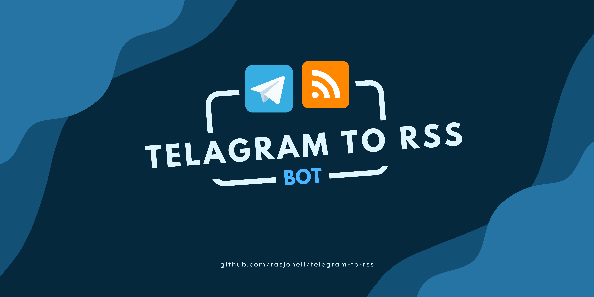

# Telegram To RSS
Generate an RSS feed from your Telegram Channel.



# How does it work?
This Project is consisted of two distinct services:
  - Telegram Bot Handler
  - Express File Server

## Telegram Bot Handler

This service listens to messages on the [discussion group chat](https://core.telegram.org/api/discussion) of you channel.

When you post a message on your channel, Telegram will automatically forward the message to the corresponding discussion group, then the bot will process the message and update the RSS feed accordingly.

## Express File Server

When the Bot Handler receives the message and updates the RSS Feed, it writes an `rss.xml` file in the `public/` directory which is served by the express static file server.

Thus you can access the RSS feed via: `<SERVER_URL>/rss.xml`.

# Getting Started
In order to use this project, you need:
  - Telegram Bot
    - Create one with [`BotFather`](https://www.teleme.io/articles/create_your_own_telegram_bot?hl=en)
    - Disable group privacy mode
    - Copy the API KEY
  - Telegram Channel
    - After creating the channel, create a discussion group.
    - Add the newly created bot account to the discussion group.

Afterwards, clone the project and install the dependencies:

```sh
git clone https://github.com/rasjonell/telegram-to-rss
```

```sh
cd telegram-to-rss
```

```sh
npm install
```

## Configuration
Follow the `.env.example` file to setup your environment.

_Note: You need to create separate `.env.{NODE_ENV}` files for each environment(i.e. `.env.dev` will be used when testing locally)_

|Name|Type|Description|
|---|---|---|
|PORT|Number|File Server Port|
|GROUP_ID|String|Your Channel ID|
|GROUP_USERNAME|String|Your Channel Username|

## Available Scripts

- `npm start` - starts the project.
- `npm run watch` - starts `nodemon` development server.
- `npm run build` - builds the TypeScript project.

## TODOs

- [ ] Make RSS feed metadata configurable
- [ ] Persist the auto-generated RSS Feed so stopping/restarting the process does not override it.
- [ ] Make Feed generation configurable(Currently only the messages from the Channel admin are allowed, but some may want to also include discussion messages from other members(i.e. replies)).